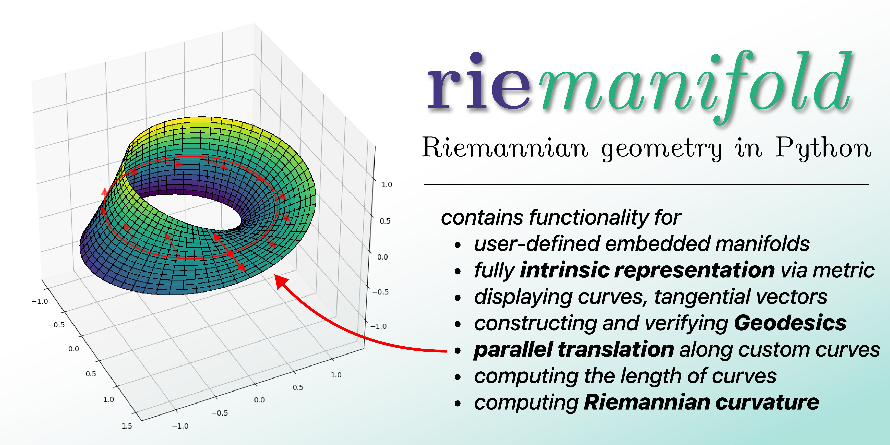

 *RieManifold* is a framework for Riemannian geometry, powered under the hood by PyTorch's computational graph and automatic differentiation system.

## Installation
The package is available through the pip package manager. Run the following command to install it on your machine:
```sh
pip install riemanifold
```

## Functionality & Usage


> [!NOTE]  
> Because *RieManifold* uses PyTorch's automatic differentiation for computations, all user-entered numerical operations must be ``torch``-compatible, such as ``torch.sin`` for sine. See a comprehensive list of available PyTorch operations [here](https://docs.pytorch.org/docs/stable/torch.html).

### Specifying a manifold

With *RieManifold*, manifolds to perform computations on may be specified either *extrinsically*, via a concrete embedding into euclidian $m$-space, or *intrinsically*, by merely specifying the metric tensor field on a coordinate system.

**Method 1: Extrinsic Definition**

Formally, let $U\subset\mathbb{R}^n$ be a coordinate domain. Then a differentiable map $\varphi : U \to \mathbb{R}^m$ constitutes an embedding of an $n$-manifold into $m$-space. In this case, the manifold is endowed with natural pullback of the euclidian metric on $\mathbb{R}^m$ to define its intrinsic geometry.\
The following shows how to construct a 2-sphere embedded into 3-space:
```python
class UVSphere(EmbeddedRiemannianManifold):
    embedding_dim = 3
    def __init__(self, r: float):
        self.r = r

    coordinate_domain = [0.0, 2*torch.pi], [0.0, torch.pi]
    default_subdivisions = 41, 41
    
    def embedded(self, coords):
        u, v = coords
        return (
            self.r * torch.sin(v) * torch.cos(u),
            self.r * torch.sin(v) * torch.sin(u),
            self.r * torch.cos(v)
        )
```

As shown in the example, these class attributes and methods must be supplied:
| Attribute / Method | Type | Meaning |
| --------- | ---- | ------- |
| ``embedding_dim`` | ``int`` | the dimension in which to embed the manifold (2 and 3 supported)
| ``coordinate_domain`` | $n\times 2$-``tuple`` | the bounds of the coordinate domain as a rectangular subset of $\mathbb{R}^n$
| ``default_subdivisions`` | $n$-``tuple`` | The amount of subdivisions across each coordinate axis when plotting
| ``embedded`` | $n$-``tuple`` $\to$ $m$-``tuple`` | the parametric embedding function

> [!IMPORTANT]  
> Both ways of specifying a manifold require the choice of a single coordinate system across the entire manifold. This simplification from the theoretical model of smooth manifolds, which allows a collection of coordinate charts (called atlas), was put in place to avoid excessive complication of the interface. It is important to be aware of, however, that some surfaces such as the 2-sphere do not admit a single coordinate system that is everywhere nondegenerate (e.g. the poles in standard coordinates), which may cause errors with computations involving these points.

**Method 2: Intrinsic Definition**

It is also possible to define geometric concepts such as lengths, angles and curvature entirely intrinsically, through a mathematical object called a **Riemannian metric**. Formally, a Riemannian metric on a coordinate domain $U\subset\mathbb{R}^n$ is a smoothly varying covariant 2-tensor field  on $U$ representing the local inner product for the tangent space at each point. The inner product at each point $p$ is a bilinear form $g_p : T_pM \times T_pM \to \mathbb{R}$ called the *metric tensor* and is represented by an $n\times n$ matrix. This matrix, as a function of the coordinates, is what the user must specify for the intrinsic manifold specification method.

The following example shows how to create the same sphere manifold as shown above, but purely intrinsically:
```python
class UVSphere(EmbeddedRiemannianManifold):
    def __init__(self, r: float):
        self.r = r
    
    def g(self, coords):
        u, v = coords
        return (
            (torch.sin(v).square() * (self.r ** 2), 0.0),
            (0.0, self.r ** 2)
        )
```
Here, the only method that needs to be implemented is the function returning the metric tensor ``g`` at the coordinates ``coords``. In the example above, for instance, the method returns the standard metric on the 2-sphere in spherical coordinates:
```math
  g_{\text{sphere}} = \begin{bmatrix} 
    r^2 & 0 \\ 
    0 & sin^2(r)r^2
  \end{bmatrix}
```

## License